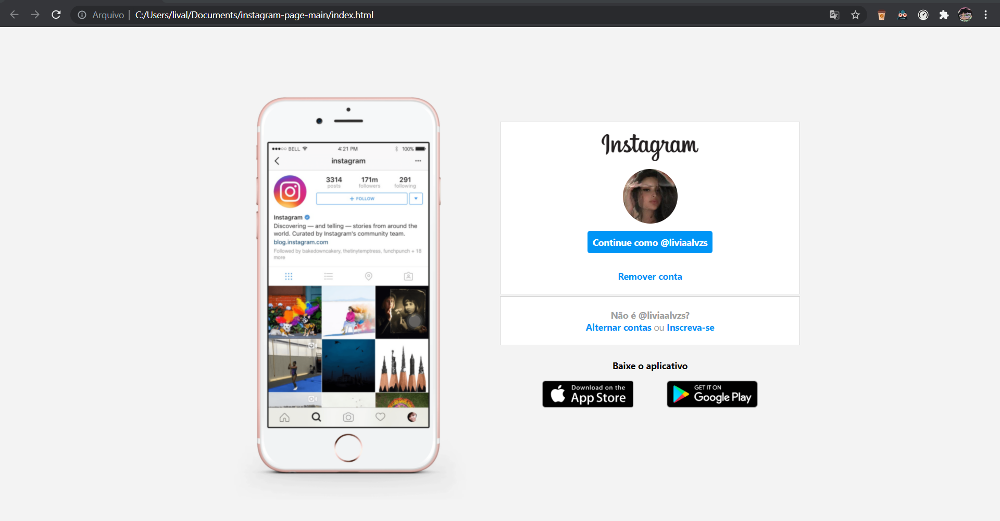

## Instagram Page :camera:
#### Esse projeto consiste na reprodução da tela inicial de login do instagram na versão web usando HTML e CSS e foi feito no bootcamp de HTML Web Developer da DIO :yellow_heart: 
#### O resultado foi o seguinte:

